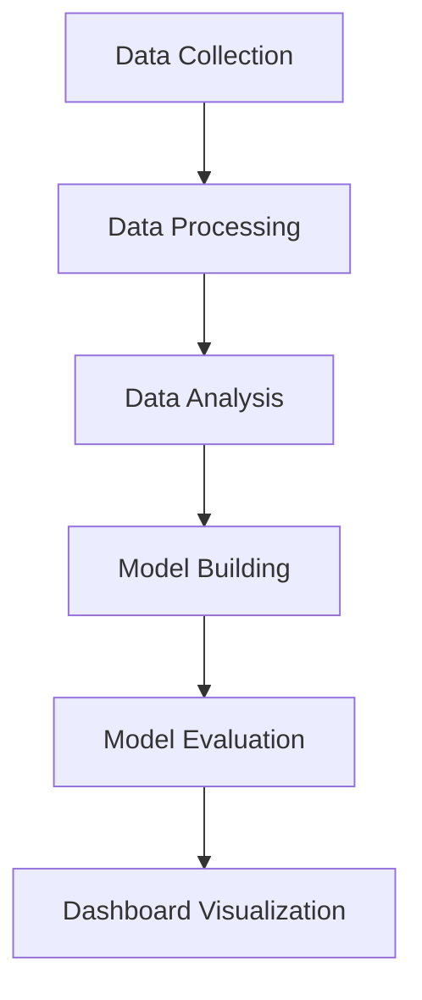

# Vietnam Stock Market Analysis & Prediction System

**Author: Vu Dang Khoa - 22010357**

## Overview

A comprehensive system for collecting, processing, analyzing, and predicting Vietnamese stock market data. The system enables investors and researchers to:

- Automatically collect market data, trading information, fundamentals, and news
- Perform multi-dimensional analysis: technical, fundamental, sentiment, and statistical
- Build optimized short-term prediction models (1-3 days) ready for real-world deployment
- Evaluate, visualize, and export model results

## Project Pipeline & Workflow



## 1. Data Collection

### Tools & Libraries
- Main tool: `data/stock_data_collector.py` 
- Uses `vnstock` API for automated data collection
- Dependencies: Install required packages from `requirements.txt`

### Data Types Collected
1. **Market Data:**
   - Daily OHLCV (Open, High, Low, Close, Volume)
   - Intraday price data
   - Market overview and indices
   
2. **Trading Information:**
   - Trading statistics
   - Foreign trading data
   - Market depth
   
3. **Company Data:**
   - Fundamental indicators
   - Financial statements
   - Company profile and events
   
4. **News & Events:**
   - Company news
   - Corporate events
   - Market news

### Steps to Collect Data
1. Install dependencies:
   ```bash
   pip install -r requirements.txt
   ```

2. Configure data collection settings in `data/stock_data_collector.py`:
   ```python
   SYMBOLS = ['VCB', 'VNM', 'FPT']  # Add/modify stock symbols
   DATE_RANGE = 365  # Number of days to collect
   ```

3. Run the collector:
   ```bash
   python data/stock_data_collector.py
   ```

4. Check collected data:
   - Data is stored in `data/collected_data/`
   - Organized by data type and stock symbol
   - CSV format with consistent structure

## 2. Data Processing

### Data Cleaning
1. **Initial Processing:**
   - Remove null values and outliers
   - Normalize data formats
   - Handle missing data
   
2. **Feature Engineering:**
   - Calculate technical indicators:
     - Moving Averages (SMA, EMA)
     - Bollinger Bands
     - RSI, MACD, ATR, OBV
   - Create prediction features:
     - Momentum indicators
     - Volatility measures
     - Pattern recognition
     - Time-based features

### Tools & Scripts
1. **Data Analysis:**
   ```bash
   python data/analysis/data_type_analyzer.py
   ```
   - Analyzes data types
   - Checks data quality
   - Reports data statistics

2. **Feature Generation:**
   ```bash
   python data/analysis/enhanced_predictor.py
   ```
   - Generates technical features
   - Creates sentiment features
   - Prepares model inputs

3. **Data Validation:**
   - Check processed data quality
   - Verify feature calculations
   - Ensure data consistency

## 3. Data Analysis

### Technical Analysis
1. **Price Analysis:**
   - Trend identification
   - Support/resistance levels
   - Chart patterns

2. **Volume Analysis:**
   - Volume trends
   - Price-volume relationships
   - Trading activity patterns

3. **Indicator Analysis:**
   - Moving average crossovers
   - RSI overbought/oversold
   - MACD signals
   - Bollinger Band breakouts

### Fundamental Analysis
1. **Company Metrics:**
   - Financial ratios
   - Growth indicators
   - Industry comparison

2. **Market Analysis:**
   - Sector performance
   - Market trends
   - Foreign investment flows

## 4. Model Building

### Model Architecture
1. **Main Model:**
   - File: `optimized_short_term_model.py`
   - Type: Optimized linear ensemble
   - Purpose: Short-term prediction (1-3 days)
   - Features: Technical, patterns, momentum

2. **Comparison Models:**
   - `lightweight_prediction_model.py`
   - `ultra_light_prediction_model.py`
   - `pure_python_prediction_model.py`

### Training Process
1. **Data Preparation:**
   ```python
   # Split data into train/validation/test
   train_data = data[:'2024']
   val_data = data['2024':'2024-06']
   test_data = data['2024-07':]
   ```

2. **Model Training:**
   ```bash
   python optimized_short_term_model.py --train
   ```
   - Trains model on historical data
   - Optimizes parameters
   - Validates performance

3. **Model Saving:**
   - Models saved in `saved_models/`
   - JSON format with weights & parameters
   - Portable for deployment

## 5. Model Evaluation

### Performance Metrics
1. **Accuracy Metrics:**
   - Prediction accuracy
   - Mean squared error
   - Direction accuracy
   - Risk-adjusted returns

2. **Visualization:**
   ```bash
   python plot_results.py
   ```
   - Generates performance charts
   - Creates comparison plots
   - Saves results in `latex_figures/`

3. **Detailed Results:**
   - Stored in `latex_figures/comprehensive_results.json`
   - CSV files for detailed analysis
   - Performance by stock and horizon

## 6. Dashboard Visualization

### Interactive Dashboard
1. **Launch Dashboard:**
   ```bash
   streamlit run data/stock_dashboard.py
   ```

2. **Features:**
   - Real-time data visualization
   - Technical analysis charts
   - Model predictions
   - Trading signals
   - Performance metrics

### Dashboard Sections
1. **Market Overview:**
   - Price and volume data
   - Market indicators
   - Foreign trading flow

2. **Technical Analysis:**
   - Multiple timeframe analysis
   - Indicator combinations
   - Pattern recognition

3. **Prediction Results:**
   - Model forecasts
   - Confidence levels
   - Performance tracking

4. **Trading Signals:**
   - Entry/exit points
   - Risk management
   - Position sizing

## Quick Start Guide

### 1. Setup Environment
```bash
# Clone repository
git clone https://github.com/yourusername/KhoaStock.git
cd KhoaStock

# Create virtual environment (optional but recommended)
python -m venv venv
source venv/bin/activate  # Linux/Mac
# or
.\venv\Scripts\activate  # Windows

# Install dependencies
pip install -r requirements.txt
```

### 2. Complete Pipeline Execution
```bash
# 1. Collect data
python data/stock_data_collector.py

# 2. Process and analyze data
python data/analysis/data_type_analyzer.py
python data/analysis/enhanced_predictor.py

# 3. Train model
python optimized_short_term_model.py --train

# 4. Evaluate and visualize results
python plot_results.py

# 5. Launch dashboard
streamlit run data/stock_dashboard.py
```

## Project Structure

```
KhoaStock/
├── data/
│   ├── collected_data/      # Raw collected data
│   ├── analysis/           # Analysis scripts
│   └── stock_dashboard.py  # Streamlit dashboard
├── saved_models/          # Trained model files
├── latex_figures/         # Results and visualizations
├── optimized_short_term_model.py
├── plot_results.py
└── requirements.txt
```

## Contributing & Support

- Author: **Vu Dang Khoa**
- For issues and contributions: Please create an issue or contact directly
- Documentation: Check [Wiki](https://github.com/Vudangkhoa0910/KhoaStock/wiki)
