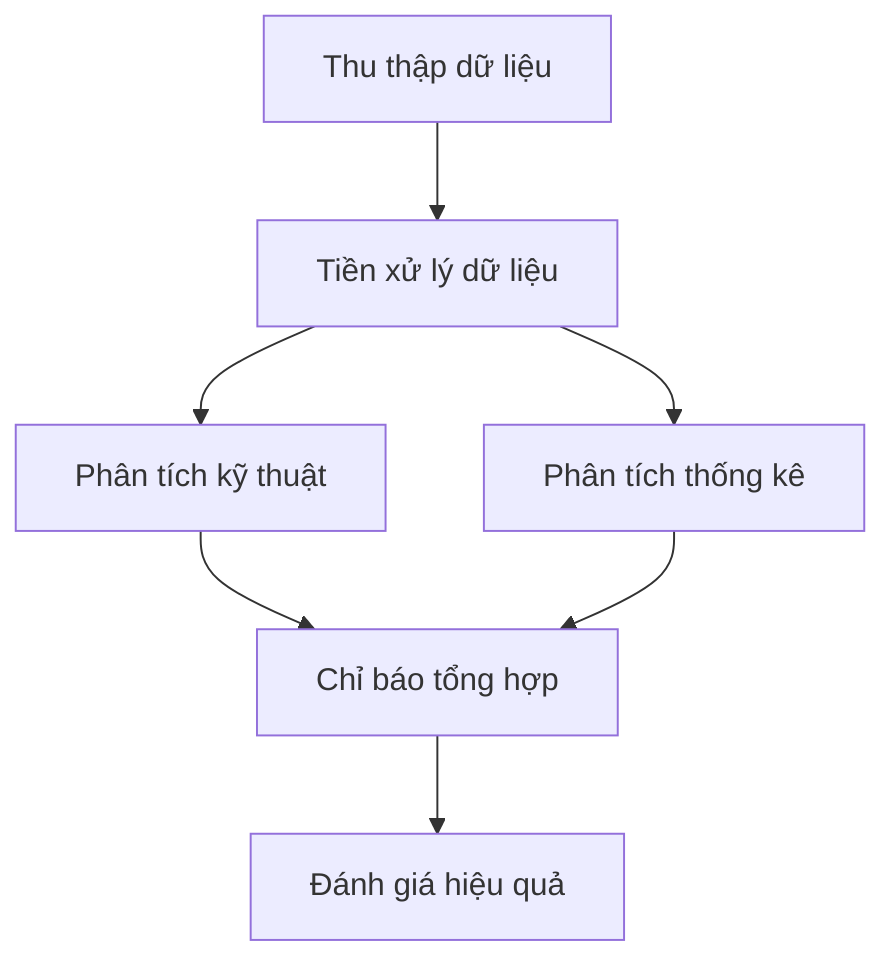
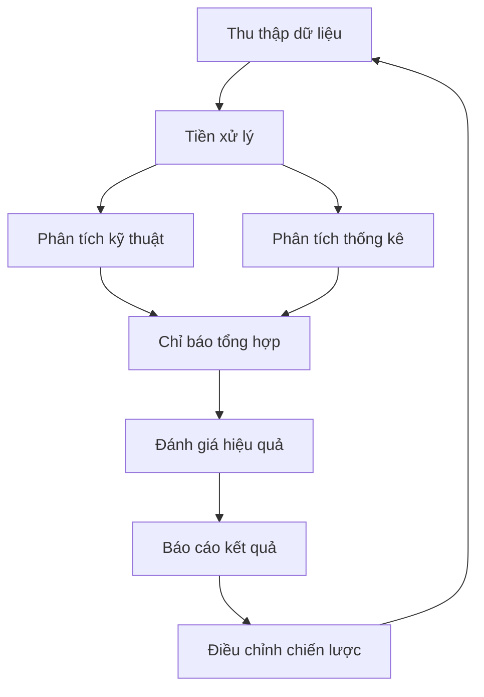

# HÌNH ẢNH MINH HỌA PHƯƠNG PHÁP NGHIÊN CỨU

## 1. Tổng quan quy trình



## 2. Phân tích kỹ thuật

### 2.1. Chỉ báo xu hướng

```python
import plotly.graph_objects as go
from plotly.subplots import make_subplots

# Tạo figure với 2 subplots
fig = make_subplots(rows=2, cols=1, shared_xaxes=True,
                    vertical_spacing=0.03, 
                    subplot_titles=('Giá & MA', 'MACD'))

# Subplot 1: Candlestick & MA
fig.add_trace(go.Candlestick(
    x=df.index,
    open=df['open'],
    high=df['high'],
    low=df['low'],
    close=df['close'],
    name='OHLC'
), row=1, col=1)

fig.add_trace(go.Scatter(
    x=df.index, 
    y=df['SMA_20'],
    name='SMA 20',
    line=dict(color='blue')
), row=1, col=1)

fig.add_trace(go.Scatter(
    x=df.index,
    y=df['SMA_50'],
    name='SMA 50',
    line=dict(color='orange')
), row=1, col=1)

# Subplot 2: MACD
fig.add_trace(go.Bar(
    x=df.index,
    y=df['MACD_Histogram'],
    name='MACD Histogram'
), row=2, col=1)

fig.add_trace(go.Scatter(
    x=df.index,
    y=df['MACD'],
    name='MACD',
    line=dict(color='blue')
), row=2, col=1)

fig.add_trace(go.Scatter(
    x=df.index,
    y=df['Signal_Line'],
    name='Signal',
    line=dict(color='orange')
), row=2, col=1)

fig.update_layout(
    title='Phân tích xu hướng với MA và MACD',
    yaxis_title='Giá',
    yaxis2_title='MACD',
    xaxis_rangeslider_visible=False
)
```

### 2.2. Chỉ báo động lượng

```python
# Tạo figure với 3 subplots
fig = make_subplots(rows=3, cols=1, shared_xaxes=True,
                    vertical_spacing=0.03,
                    subplot_titles=('RSI', 'Stochastic', 'MFI'))

# Subplot 1: RSI
fig.add_trace(go.Scatter(
    x=df.index,
    y=df['RSI'],
    name='RSI',
    line=dict(color='blue')
), row=1, col=1)

fig.add_hline(y=70, line_dash="dash", line_color="red", row=1, col=1)
fig.add_hline(y=30, line_dash="dash", line_color="green", row=1, col=1)

# Subplot 2: Stochastic
fig.add_trace(go.Scatter(
    x=df.index,
    y=df['Stoch_K'],
    name='%K',
    line=dict(color='blue')
), row=2, col=1)

fig.add_trace(go.Scatter(
    x=df.index,
    y=df['Stoch_D'],
    name='%D',
    line=dict(color='orange')
), row=2, col=1)

# Subplot 3: MFI
fig.add_trace(go.Scatter(
    x=df.index,
    y=df['MFI'],
    name='MFI',
    line=dict(color='purple')
), row=3, col=1)

fig.update_layout(
    title='Chỉ báo động lượng',
    height=800,
    xaxis_rangeslider_visible=False
)
```

### 2.3. Chỉ báo biến động

```python
# Tạo figure với 2 subplots
fig = make_subplots(rows=2, cols=1, shared_xaxes=True,
                    vertical_spacing=0.03,
                    subplot_titles=('Bollinger Bands', 'ATR'))

# Subplot 1: Bollinger Bands
fig.add_trace(go.Candlestick(
    x=df.index,
    open=df['open'],
    high=df['high'],
    low=df['low'],
    close=df['close'],
    name='OHLC'
), row=1, col=1)

fig.add_trace(go.Scatter(
    x=df.index,
    y=df['BB_Upper'],
    name='Upper BB',
    line=dict(color='gray', dash='dash')
), row=1, col=1)

fig.add_trace(go.Scatter(
    x=df.index,
    y=df['BB_Middle'],
    name='Middle BB',
    line=dict(color='blue')
), row=1, col=1)

fig.add_trace(go.Scatter(
    x=df.index,
    y=df['BB_Lower'],
    name='Lower BB',
    line=dict(color='gray', dash='dash')
), row=1, col=1)

# Subplot 2: ATR
fig.add_trace(go.Scatter(
    x=df.index,
    y=df['ATR'],
    name='ATR',
    line=dict(color='red')
), row=2, col=1)

fig.update_layout(
    title='Chỉ báo biến động',
    yaxis_title='Giá',
    yaxis2_title='ATR',
    xaxis_rangeslider_visible=False
)
```

## 3. Phân tích thống kê

### 3.1. Ma trận tương quan

```python
import seaborn as sns
import matplotlib.pyplot as plt

# Tạo heatmap tương quan
plt.figure(figsize=(10, 8))
sns.heatmap(correlation_matrix, 
            annot=True, 
            cmap='coolwarm', 
            vmin=-1, 
            vmax=1, 
            center=0)
plt.title('Ma trận tương quan giữa các chỉ báo')
plt.tight_layout()
```

### 3.2. Phân tích tự tương quan

```python
# Tạo figure với 2 subplots
fig = make_subplots(rows=2, cols=1, shared_xaxes=True,
                    vertical_spacing=0.03,
                    subplot_titles=('ACF - Giá', 'ACF - Volume'))

# Subplot 1: ACF của giá
fig.add_trace(go.Bar(
    x=list(range(1, len(price_autocorr) + 1)),
    y=price_autocorr,
    name='Price ACF'
), row=1, col=1)

# Subplot 2: ACF của volume
fig.add_trace(go.Bar(
    x=list(range(1, len(volume_autocorr) + 1)),
    y=volume_autocorr,
    name='Volume ACF'
), row=2, col=1)

fig.update_layout(
    title='Phân tích tự tương quan',
    xaxis_title='Lag',
    yaxis_title='ACF',
    showlegend=True
)
```

## 4. Chỉ báo tổng hợp

### 4.1. Composite Technical Indicator

```python
fig = go.Figure()

fig.add_trace(go.Scatter(
    x=df.index,
    y=df['close'],
    name='Giá đóng cửa',
    yaxis='y1'
))

fig.add_trace(go.Scatter(
    x=df.index,
    y=composite_indicator,
    name='Composite Indicator',
    yaxis='y2'
))

fig.update_layout(
    title='Chỉ báo tổng hợp và giá',
    yaxis=dict(title='Giá', side='left'),
    yaxis2=dict(title='Composite Indicator', side='right', overlaying='y'),
    xaxis_rangeslider_visible=False
)
```

### 4.2. Market Strength Index

```python
fig = make_subplots(rows=2, cols=1, shared_xaxes=True,
                    vertical_spacing=0.03,
                    subplot_titles=('Giá & Volume', 'Market Strength'))

# Subplot 1: Giá và Volume
fig.add_trace(go.Candlestick(
    x=df.index,
    open=df['open'],
    high=df['high'],
    low=df['low'],
    close=df['close'],
    name='OHLC'
), row=1, col=1)

fig.add_trace(go.Bar(
    x=df.index,
    y=df['volume'],
    name='Volume',
    opacity=0.3
), row=1, col=1)

# Subplot 2: Market Strength
fig.add_trace(go.Scatter(
    x=df.index,
    y=df['Market_Strength'],
    name='Market Strength',
    line=dict(color='blue')
), row=2, col=1)

fig.update_layout(
    title='Chỉ số sức mạnh thị trường',
    yaxis_title='Giá',
    yaxis2_title='Market Strength',
    xaxis_rangeslider_visible=False
)
```

## 5. Đánh giá hiệu quả

### 5.1. Phân tích lợi nhuận

```python
fig = go.Figure()

fig.add_trace(go.Scatter(
    x=df.index,
    y=cum_returns,
    name='Lợi nhuận tích lũy',
    line=dict(color='blue')
))

fig.add_trace(go.Scatter(
    x=df.index,
    y=rolling_max,
    name='High Watermark',
    line=dict(color='green', dash='dash')
))

fig.update_layout(
    title='Phân tích lợi nhuận và Drawdown',
    yaxis_title='Lợi nhuận tích lũy',
    xaxis_rangeslider_visible=False
)
```

### 5.2. Phân tích rủi ro

```python
# Biểu đồ phân phối lợi nhuận
fig = go.Figure()

fig.add_trace(go.Histogram(
    x=returns,
    name='Phân phối lợi nhuận',
    nbinsx=50,
    opacity=0.7
))

fig.add_vline(x=var_95, 
              line_dash="dash", 
              line_color="red",
              annotation_text="VaR 95%")

fig.add_vline(x=var_99,
              line_dash="dash",
              line_color="darkred",
              annotation_text="VaR 99%")

fig.update_layout(
    title='Phân phối lợi nhuận và VaR',
    xaxis_title='Lợi nhuận',
    yaxis_title='Tần suất',
    showlegend=True
)
```

## 6. Tổng kết



Lưu ý: Các biểu đồ trên được tạo bằng thư viện Plotly và Seaborn, cần có dữ liệu thực tế để hiển thị. Mã nguồn trên chỉ là template để tạo biểu đồ khi có dữ liệu. 