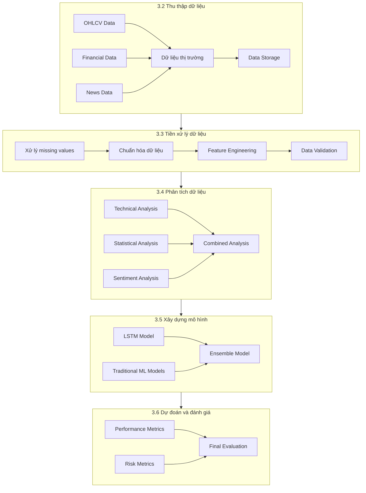
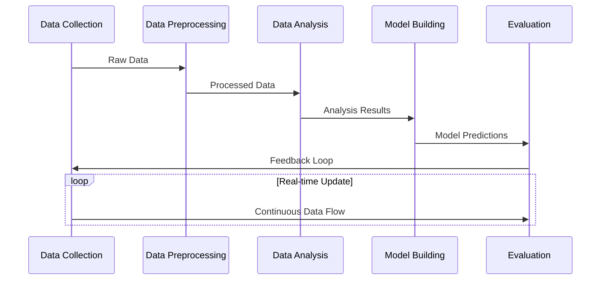

# PIPELINE PHƯƠNG PHÁP NGHIÊN CỨU KHOASTOCK



## Chi tiết các bước

### 1. Thu thập dữ liệu (3.2)
```python
# Pipeline thu thập dữ liệu
data_collection_pipeline = {
    'market_data': {
        'source': 'vnstock API',
        'frequency': 'realtime',
        'data_types': ['OHLCV', 'Index', 'Derivatives']
    },
    'financial_data': {
        'source': 'company reports',
        'frequency': 'quarterly',
        'data_types': ['Balance Sheet', 'Income Statement', 'Cash Flow']
    },
    'news_data': {
        'source': 'news APIs',
        'frequency': 'continuous',
        'data_types': ['Market News', 'Company News']
    }
}
```

### 2. Tiền xử lý dữ liệu (3.3)
```python
# Pipeline tiền xử lý
preprocessing_pipeline = {
    'missing_values': {
        'numerical': 'interpolation',
        'categorical': 'mode filling',
        'time_series': 'forward fill'
    },
    'normalization': {
        'price_data': 'min-max scaling',
        'financial_ratios': 'z-score normalization',
        'technical_indicators': 'decimal scaling'
    },
    'feature_engineering': {
        'technical': ['SMA', 'EMA', 'RSI', 'MACD'],
        'fundamental': ['P/E', 'P/B', 'ROE', 'ROA'],
        'sentiment': ['News Score', 'Market Sentiment']
    }
}
```

### 3. Phân tích dữ liệu (3.4)
```python
# Pipeline phân tích
analysis_pipeline = {
    'technical_analysis': {
        'trend_analysis': ['Moving Averages', 'Trend Lines'],
        'momentum_analysis': ['RSI', 'MACD', 'Stochastic'],
        'volatility_analysis': ['Bollinger Bands', 'ATR']
    },
    'statistical_analysis': {
        'correlation': 'Pearson Correlation',
        'stationarity': 'ADF Test',
        'normality': 'Shapiro-Wilk Test'
    },
    'sentiment_analysis': {
        'news_processing': 'NLP',
        'sentiment_scoring': 'VADER',
        'market_sentiment': 'Aggregated Score'
    }
}
```

### 4. Xây dựng mô hình (3.5)
```python
# Pipeline mô hình
model_pipeline = {
    'deep_learning': {
        'architecture': 'LSTM',
        'layers': [
            {'type': 'LSTM', 'units': 50},
            {'type': 'Dropout', 'rate': 0.2},
            {'type': 'Dense', 'units': 1}
        ]
    },
    'ensemble': {
        'models': ['RandomForest', 'XGBoost', 'LightGBM'],
        'stacking': 'LinearRegression'
    }
}
```

### 5. Đánh giá hiệu quả (3.6)
```python
# Pipeline đánh giá
evaluation_pipeline = {
    'performance_metrics': {
        'accuracy': ['MAE', 'RMSE', 'Direction Accuracy'],
        'trading': ['Returns', 'Sharpe Ratio', 'Max Drawdown']
    },
    'validation': {
        'cross_validation': '5-fold',
        'backtesting': 'Walk-forward optimization'
    },
    'monitoring': {
        'model_drift': 'KS-test',
        'performance_decay': 'Moving window analysis'
    }
}
```

## Luồng dữ liệu



## Kiến trúc hệ thống

```mermaid
graph LR
    subgraph Data Layer
        D1[Raw Data] --> D2[Processed Data]
        D2 --> D3[Feature Store]
    end

    subgraph Processing Layer
        P1[Data Pipeline] --> P2[Analysis Pipeline]
        P2 --> P3[Model Pipeline]
    end

    subgraph Service Layer
        S1[API Services] --> S2[Model Services]
        S2 --> S3[Monitoring Services]
    end

    Data Layer --> Processing Layer
    Processing Layer --> Service Layer
``` 